# Gopherbot Kit Parts

The Gopherbot kit consists of the following parts:

### Helmet
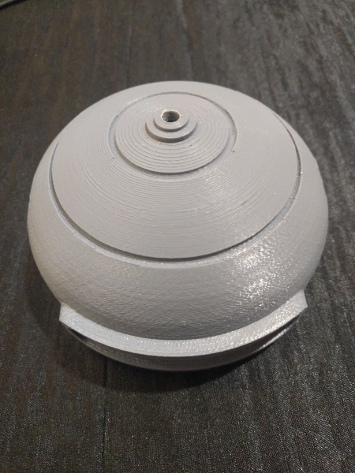

### Helmet - Ears
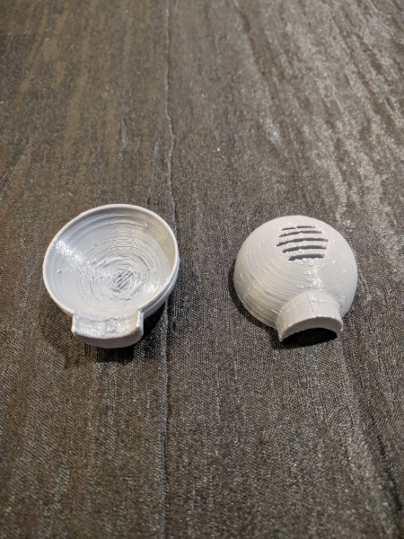

### Backpack
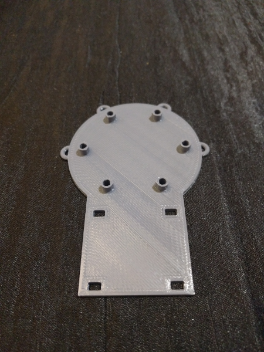

### Circuit Playground Express board
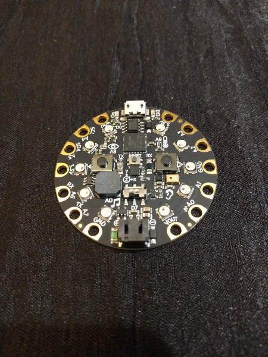

### Plushie
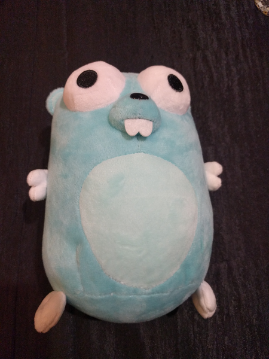

### RGB LED Strip
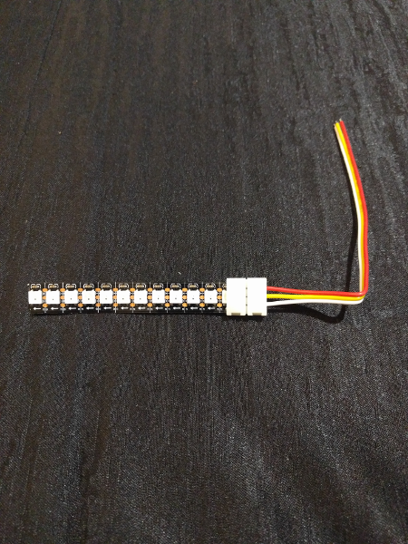

### Antenna Spring
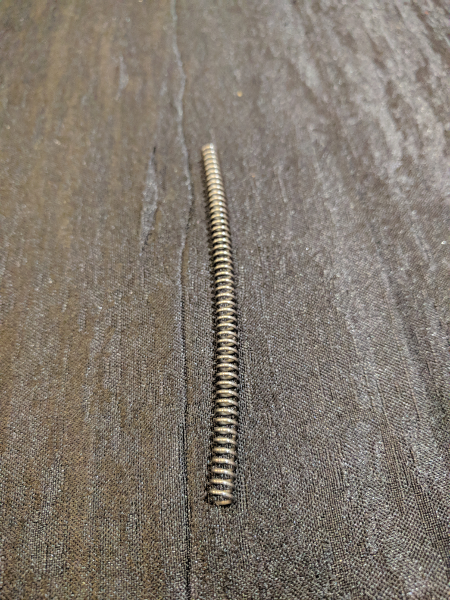

### Antenna Washers
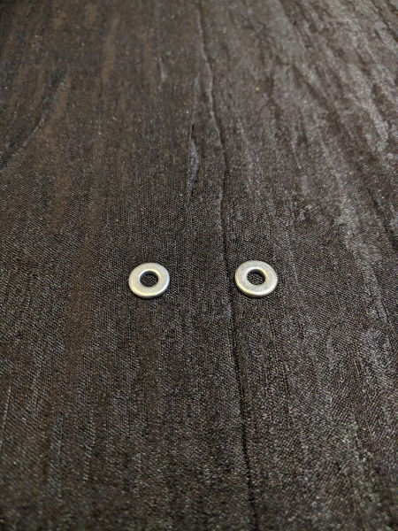

### Antenna Lock Washers
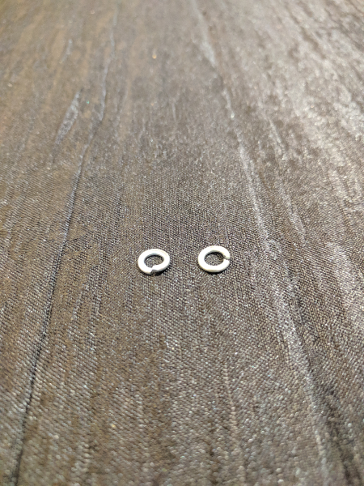

Antenna Spring (90mm length, 6mm diameter + 2 M5 locking washers)

### Wired LED w/resistor
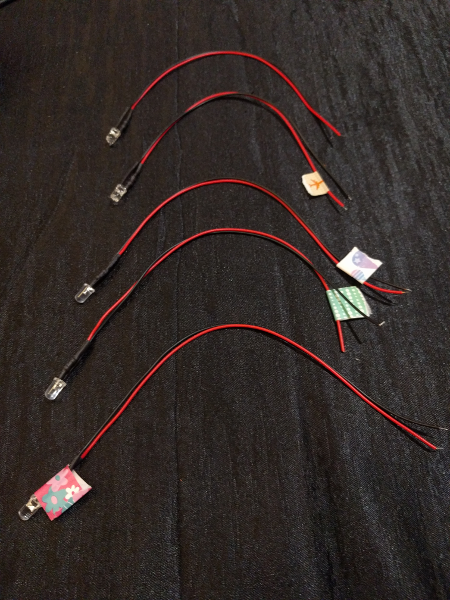

Your kit includes five different colors of pre-wired LED w/resistor.

### Gel strip
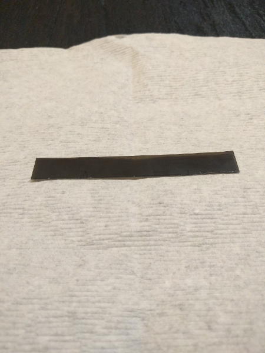

Gel strip for visor

### USB Cable
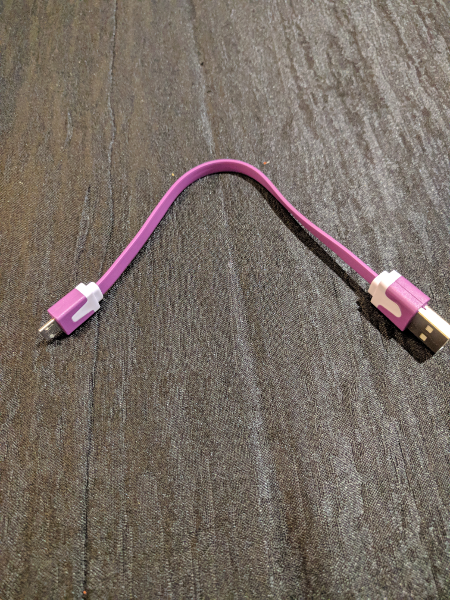

### 2 female bayonet connectors
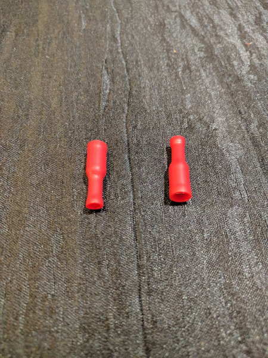

### 2 male bayonet connectors
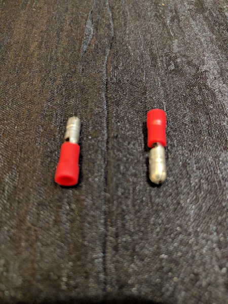

### 3 solderless connectors
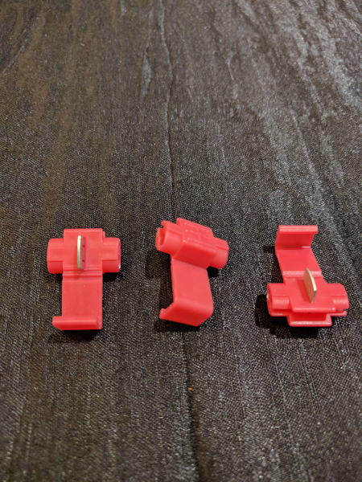

### 4 fork terminals
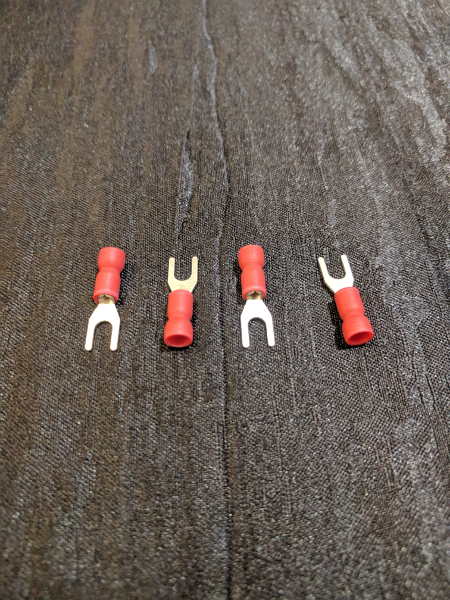

### Ribbon cable
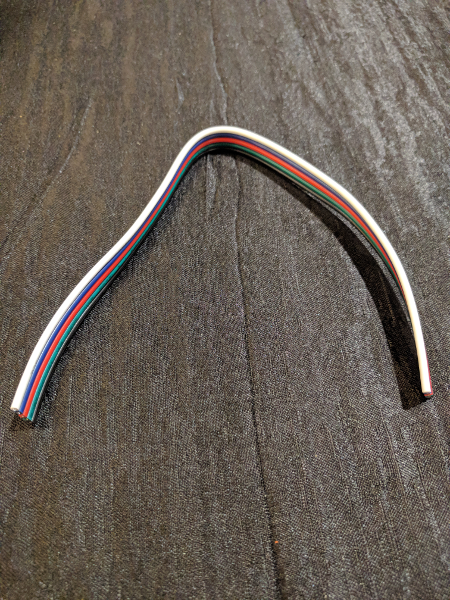

### 10mm Machine screws

6 M3 10mm machine screws

### 6mm Machine screws
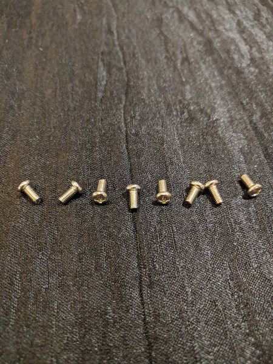

8 M3 6mm machine screws

### M3 nuts
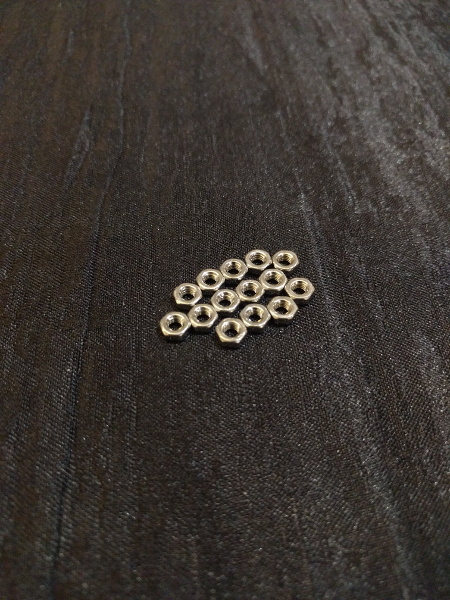

14 M3 nuts

### M3 washers
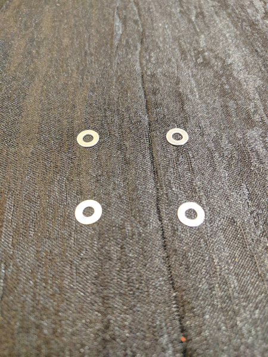

4 M3 washers

### Elastic
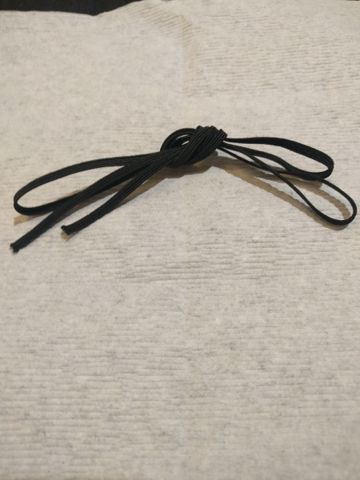

### Tie Wraps

