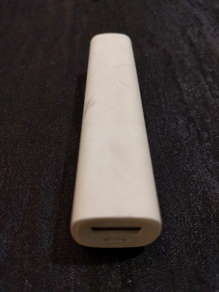
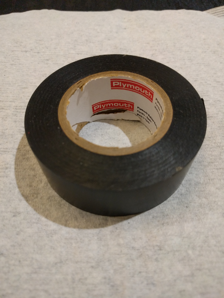
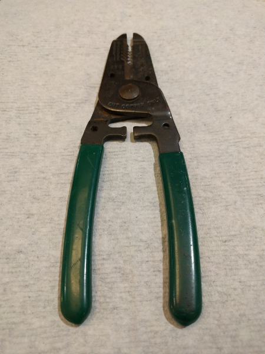
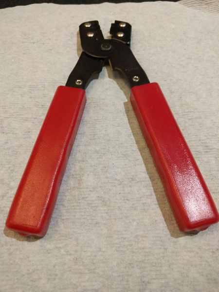
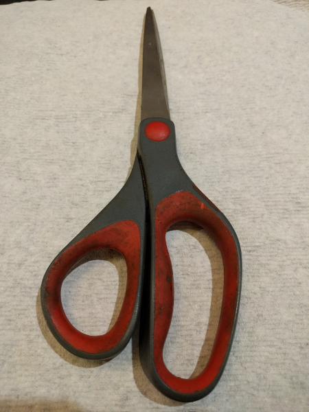
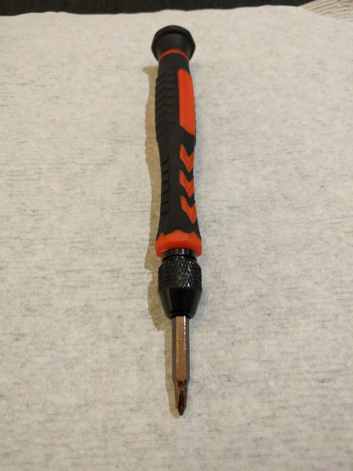

# Assembling Your Gopherbot Kit

Here are instructions on how to assemble your Gopherbot kit.

## Preparation

### Check Your Parts

Start by verifying that you have all your parts. Take a look at the list of [kit parts](./KIT.md).

### Things You Need That Are Not In The Kit

There are several items you will need that are not included in the Gopherbot kit:

#### 5V USB Battery

Your basic 5V rechargable battery.

#### Black electrical tape

Black electrical tape (approx 40mm wide and 100mm in length). You can also use black duct tape.

#### Wire cutter/stripper

#### Wire crimper

#### Scissors

#### Small Phillips head screwdriver

## Assembly

### Helmet - Visor

The helmet has an LED-filled visor.

Here are the [visor assembly instructions](./visor.md).

### Helmet - Antenna

Now that the visor is installed, it is time to attach the antenna to the helmet.

Here are the [antenna assembly instructions](./antenna.md).

### Helmet - Ears and cables

Attach the ears, and then tie wrap the cables neatly to the helmet.

Here are the [ears and cables assembly instructions](./ears-cables.md).

### Backpack

Now it is time to assemble the 3D printed backpack.

Here are the [backpack assembly instructions](.backpack.md).

### Putting on the helmet and backpack

You should now be ready to put the helmet and backpack on your plushie.

### Next steps

Now that your Gopherbot is fully assembled, go back to the main README and continue with the software installation on your computer so you can write yur own programs.
