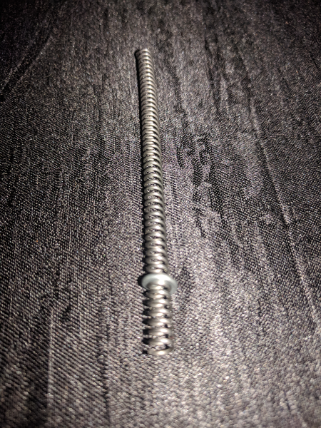
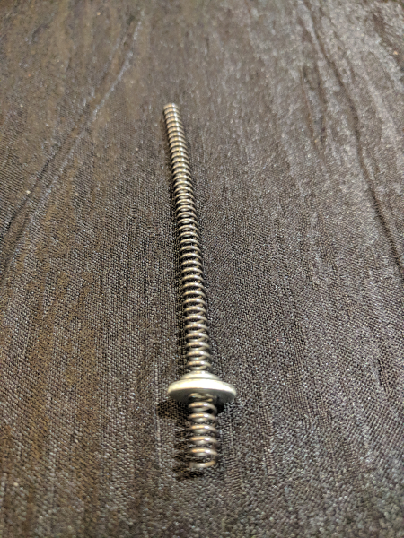
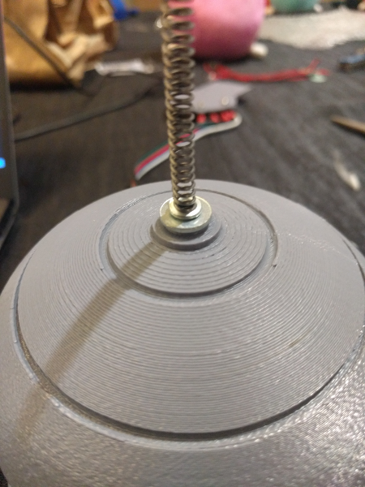
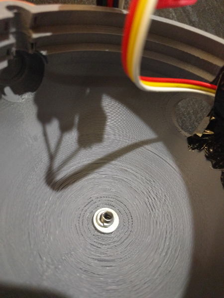
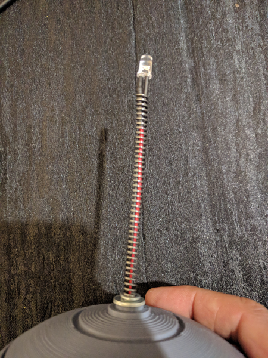
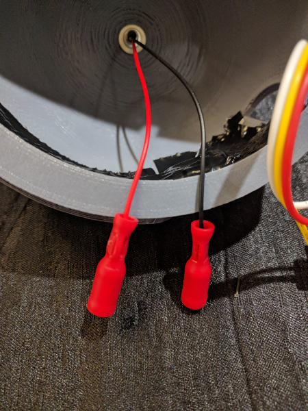
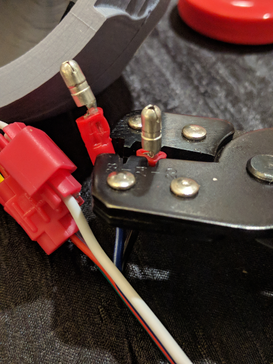
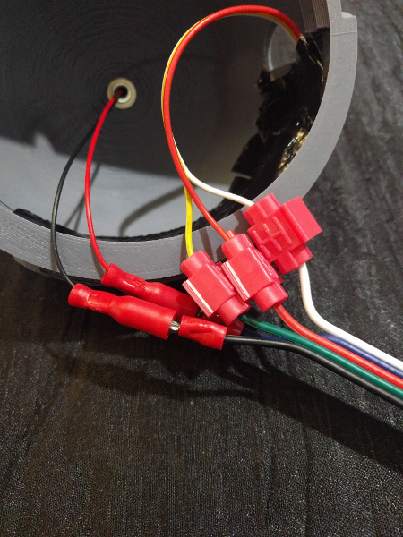

# Helmet - Antenna

Now that the visor is installed, it is time to attach the antenna to the helmet.

## Screw first locking washer onto spring

Screw one of the M6 locking washers to around 1.5 cm up the spring.

## Slide flat washer onto spring

Slide one of the flat washers up the spring until it is flat against the locking washer.

## Slide the spring into the top of the helmet

Slide the spring into the top of the helmet up to the flat washer.

## Slide second flat washer onto spring

Slide second flat washer onto spring from *inside the helmet*.

## Screw second locking washer onto spring

Screw second locking washer onto spring from *inside the helmet*.

## Insert LED with resistor thru spring from top

Insert the LED with pre-wired resistor into the spring from the top, and carefully pull thru until the LED is as even as possible with the top of the spring. It does not need to be pulled very tight. You probably will not be able to pull it all the way, just pull util it cannot go any further.

## Connect female bayonet connectors to LED

Use your wire strippers to strip off the insulation of the last 7mm of each of the wires on the ends of the red and black wires on the LED leaving the bare wires exposed.

Crimp one of female bayonet terminals to the black wire on the LED with your crimpers. Make sure to push the wire into the bayonet terminal so that the bare wire is sticking thru slightly, but not all the way thru.

Crimp one of female bayonet terminals to the red wire on the LED with your crimpers, in the same way that you crimped the black wire.

## Connect male bayonet connectors to ribbon cable

Use your wire strippers to strip off the insulation of the last 7mm of the blue and black wires on the ribbon cable, which should be the only wires on the ribbon cable that are not yet connected. Make sure to leave the bare wires exposed.

Crimp one of male bayonet terminals to the black wire on the ribbon cable with your crimpers. Make sure to push the wire into the bayonet terminal so that the bare wire is sticking thru slightly, but not all the way thru.

Crimp one of male bayonet terminals to the blue wire on the ribbon cable with your crimpers, in the same way that you crimped the black wire.

## Plug male bayonet connectors into female bayonet connectors

Plug the male bayonet connector from the black wire on the ribbon cable into the female connector on the black wire on the LED.

Plug the male bayonet connector from the blue wire on the ribbon cable into the female connector on the red wire on the LED.

## Next step

Now you are ready to proceed by tie wrapping the cables neatly to the helmet, and then attaching the ears.

Here are the [ears and cables assembly instructions](./ears-cables.md).
