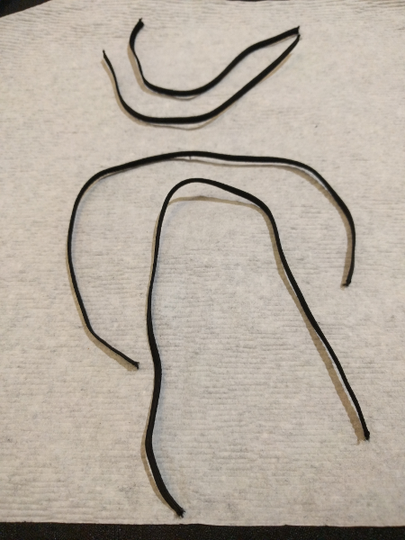
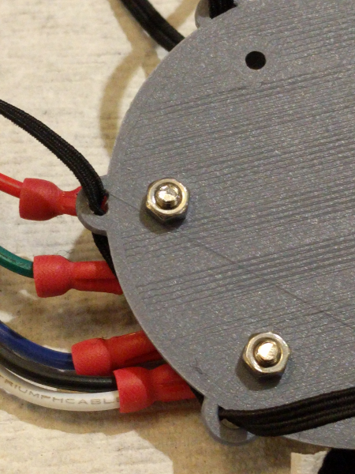
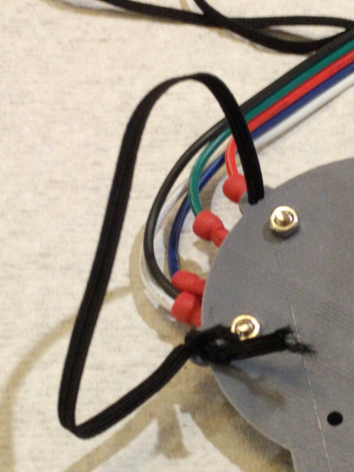
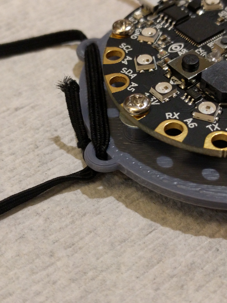
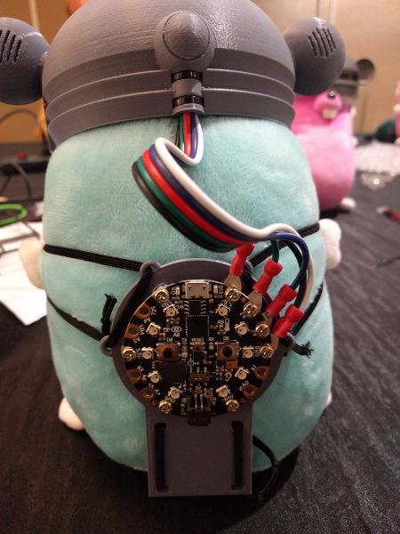
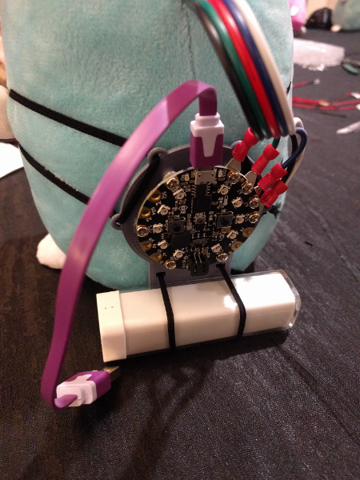

# Backpack

Now it is time to complete the 3D printed backpack.

## Cut elastic backpack straps

Cut the elastic cord to make the backpack straps.

Cut two pieces that are 23 cm long.

Cut two pieces that are 13 cm long.

## Tie on nylon backpack straps

Pass the end of the first longer elastic strap thru both top holes on one side of the backpack. Tie an overhand knot on each end and tie the two ends together.

Pass the end of the second longer elastic strap thru both top holes on the other side of the backpack. Tie an overhand knot on each end and tie the two ends together.

Pass the end of the first shorter elastic strap thru both bottom holes on one side of the backpack. Tie an overhand knot on each end and tie the two ends together.

Pass the end of the second shorter elastic strap thru both bottom holes on one side of the backpack. Tie an overhand knot on each end and tie the two ends together.

## Attach Circuit Playground Express to backpack

Finish attaching the Circuit Playground Express to backpack using four 10mm machine screws, four M3 washers, and four M3 nuts.

Pass one 10mm machine screw thru the front, slipping a washer in between the back of the board and the backpack standoff.

## Put the helmet and backpack on plushie

Place the helmet on the plushie's head, and place the backpack on using the elastic straps.

## Attach USB battery

Attach the USB battery to the backpack by using the bottom elastic straps. Make sure the USB's connector is on the left hand side.

## Next steps

Plug in the battery. Your Gopherbot should light up. You are ready to play!

Now that your Gopherbot is fully assembled, go back to the main [README](../README.md) and perform the software installation on your computer so you can write your own programs.
