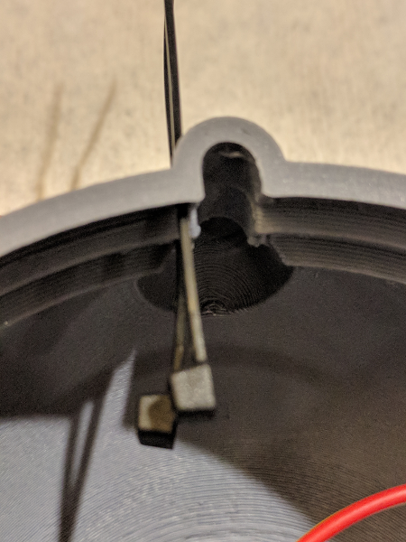
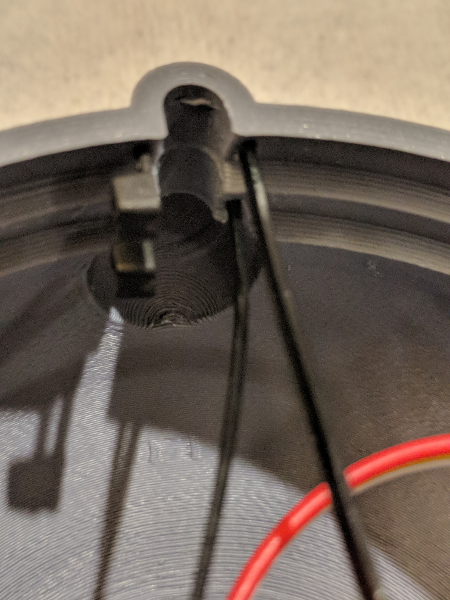
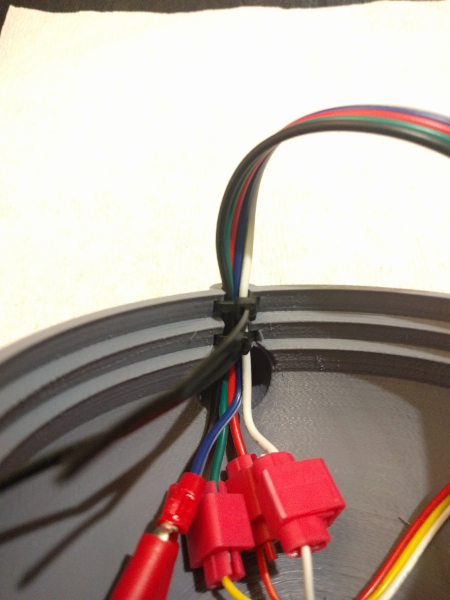
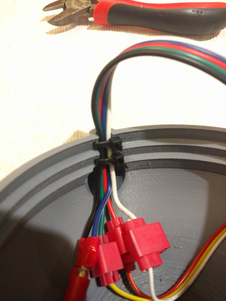

# Helmet - Ears and cables

Tie wrap the cables neatly to the helmet, and then attach the ears.

## Feed tie wraps to thru helmet

Feed the tie wraps thru the small holes in the back of the helmet, starting from the inside.

## Route ribbon cable thru channel

Fold the ribbon cable gently, and then insert in the channel in the back of the helmet.

## Use tie wraps to secure ribbon cable

Pull each tie wrap tight to hold the ribbon cable in place. You might need to slide the tie wrap to be able to tighten it down completely.

Once the tie wraps are tightened, cut off the ends.

## Attach ears

Slide the ears into the holes on the sides of the helmet. They will be snug, but should fit. Do not use too much force.

## Next steps

Now it is time to finish assembling the 3D printed backpack.

Here are the [backpack assembly instructions](./backpack.md).
