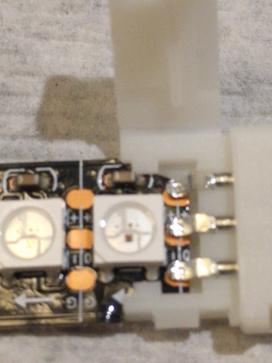

# RGB LED Strip

If you run into problems with the RGB LED strip not lighting up, and you are certain you have connected it correctly, it might be an issue with the 3-pin solderless connector that was included with the Gopherbot kits.

The + pin inside some of the 3-pin connectors is slightly misaligned. You might be able to just push or wiggle the RGB LED strip a little bit, and it might light up. If this works, you can secure the positioning with a small strip of electrical tape so that it stays lit.

Otherwise, try the following procedure.

First, open up the white plastic connector by gently opening the snap-catch on the side to open the lid.

Once opened, you should be able to visibly see if the + pin on the connector is properly aligned with the copper pad on the RGB LED strip itself. You can bend down the + pin inside the connector towards the other pins with something like a toothpick, so that it sits more directly on top of the RGB LED strip's copper pad labeled +.

You might need to remove the LED strip, bend the pin into position, and then push the RGB LED strip back into place.

Once you have corrected the + pin positioning, gently but firmly close the 3-pin connector back up so that it holds the RGB LED strip in place. Make sure the snap catch on the connector clicks shut, or the connector will not hold the RGB LED strip in place.

If for any reason this does not work, please email me and I will mail you another LED strip/connector that has been soldered together.
