# Helmet - Visor

The helmet has an LED-filled visor. In this section we will assemble it.

You will need the small piece of tape to complete this assembly. The most permanent solution is to use a small bit of black duct tape. Other colors will also work, as you cannot see the tape from the outside of the helmet.

You can also use other kinds of tape, as long as it sticks to the PLA material used on the helmet. For example, black electrical tape.

Some kinds of tape that are known NOT to work well: gift wrapping tape, painters tape.

## Cut ribbon cable to proper lengths

Take the ribbon cable and separate the last 7cm of the ends.

Cut the last 1 cm off of the blue wire.

Cut the last 2 cm off of the green wire.

Cut the last 3 cm off of the red wire.

Do not cut the black or white wires.

## Attach RGB LED Strip 3-pin connector to ribbon cable

Take the ribbon cable and separate the last 3cm of the uncut end.

Trim off the exposed wire tips on the ends of the RGB LED's 3 wire connector.

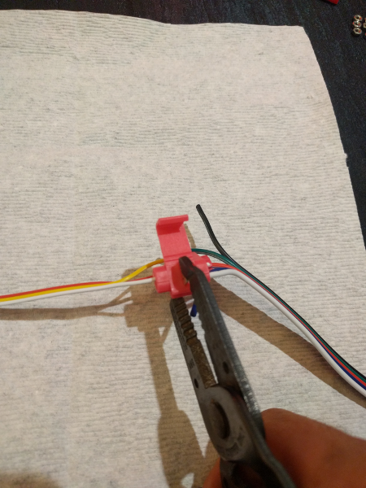

Crimp the red wire on the 3-pin connector to the red wire on the ribbon cable's uncut side using the solderless connector with your pliers.

Crimp the white wire on the 3-pin connector to the white wire on the ribbon cable's uncut side using the solderless connector with your pliers.

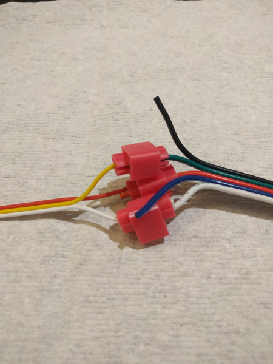

Crimp the yellow wire on the 3-pin connector to the green wire on the ribbon cable's uncut side using the solderless connector with your pliers.

## Crimp spade fork terminals to cut end of ribbon cable

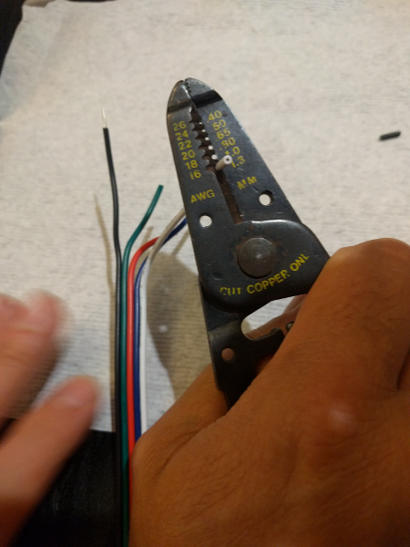

Use your wire strippers to strip off the insulation of the last 7mm of each of the wires on the cut end of the ribbon cable, leaving the bare wires exposed.

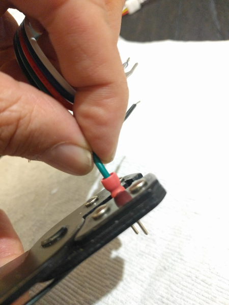

Crimp one of the fork terminals to the red wire on the ribbon cable's cut side with your crimpers. Make sure to push the wire all the way thru the fork terminal so that the bare wire is sticking thru slightly.

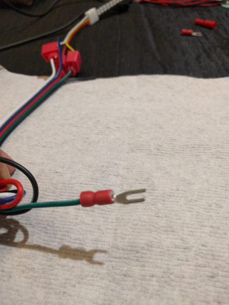

Crimp one of the fork terminals to the green wire on the ribbon cable's cut side with your crimpers.

Crimp one of the fork terminals to the blue wire on the ribbon cable's cut side with your crimpers.

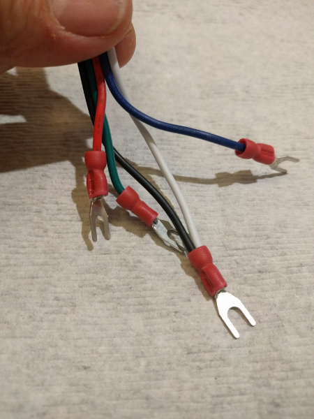

Crimp both the white and black terminals using the last fork terminal.

## Attach ribbon cable green and blue wires to Circuit Playground Express

Attach ribbon cable to Circuit Playground Express using the fork connectors.

Take 2 of the 6mm machine screws and 2 of the M3 nuts.

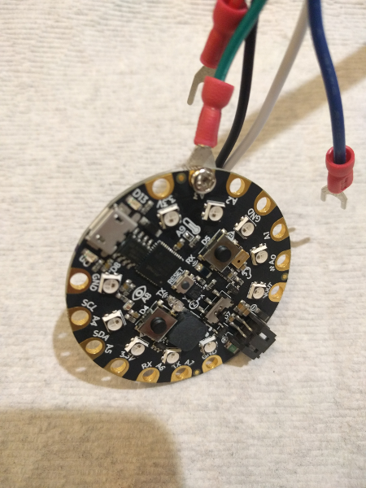

Connect the green wire's fork connector to the back side of the Circuit Playground Express "A3" terminal using the 6mm machine screw and one of the M3 nuts.

Connect the blue wire's fork connector to the back side of the Circuit Playground Express "A2" terminal using the 6mm machine screw and one of the M3 nuts.

## Attach ribbon cable red and black/white wires to Circuit Playground Express and backpack

Attach ribbon cable to Circuit Playground Express using the fork connectors.

Take 2 of the 6mm machine screws and 2 of the M3 nuts.

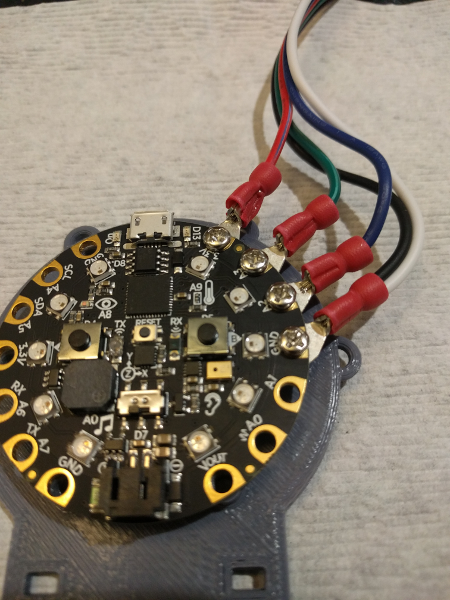

Connect the red wire's fork connector to the back side of the Circuit Playground Express "3.3V" terminal using the 10mm machine screw and one of the M3 nuts.

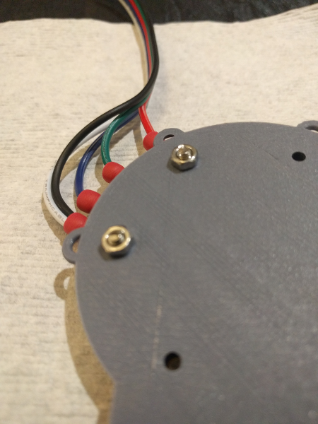

Connect the white and black wire's fork connector to the back side of the Circuit Playground Express "GND" terminal using the 10mm machine screw and one of the M3 nuts.

## Test the RGB LED strip

Run a test program to make sure that the LEDs are wired correctly by plugging in the Circuit Playground Express to a battery or your computer's USB port. If the RGB LED strip does not light up, it might be due to a mis-aligned "+" connector inside the plastic housing. For information on how to correct this, [click here]().

## Place gel strip inside visor

Peel off the protective coating from the small gel strip, and then place the gel strip inside the helmet into the small space inside the visor. You might need to use a small scissors to trim the edges so it can fit.

## Place LEDs inside visor

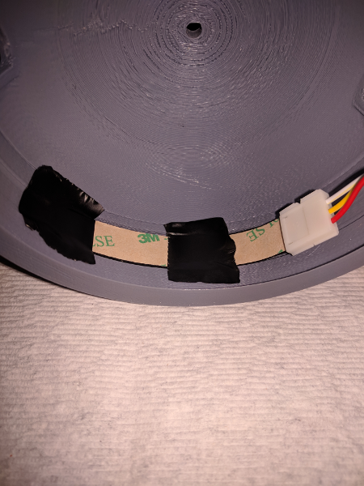

Place the RGB LED strip on top of the gel strip from inside the helmet in the small space inside the visor.

## Tape down the LEDs/gel strip

Carefully use the tape to finish taping down the LEDs/gel strip to the inside of the helmet.

## Route the wires around the inside of the helmet

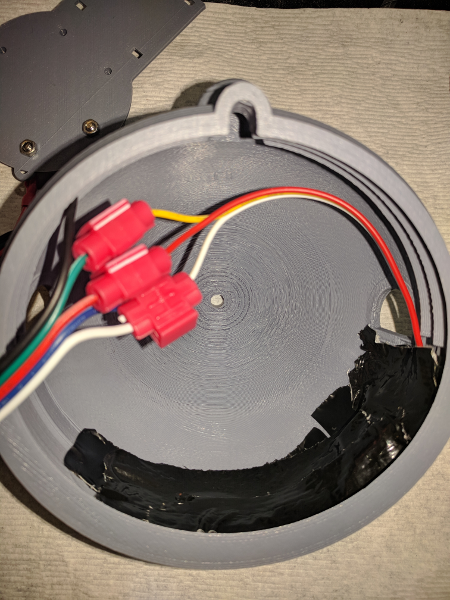

Route the wires around the inside of the helmet, but do not attach them to anything yet.

## Next step

Now that the visor is installed, it is time to attach the antenna to the helmet.

Here are the [antenna assembly instructions](./antenna.md).
